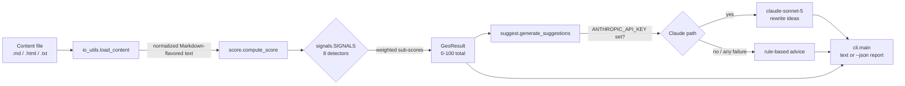

# geo-content-optimizer

> Score how likely your content is to be surfaced and cited by AI answer engines — a transparent, offline GEO heuristic with prioritized suggestions.


## Overview

**Generative Engine Optimization (GEO)** is the practice of structuring content so that AI answer engines — ChatGPT, Perplexity, Google AI Overviews, and the like — can extract, quote, and cite it inside generated answers. Where classic SEO optimizes to rank a page in a list of links, GEO optimizes to be the passage a model actually surfaces.

`geo-content-optimizer` reads a Markdown, HTML, or plain-text file and returns a **0-100 GEO score** built from eight weighted content signals, plus a prioritized list of concrete edits that would raise it.

> **Honesty note:** this is a portfolio/demo project. The GEO score is a **transparent heuristic** — a weighted sum of rule-based signal detectors, not a machine-learned model and not a live feedback loop from any answer engine. It encodes widely-cited GEO best practices; it does not observe real citation rates. Treat it as an editorial checklist with a number attached, not ground truth.

## Architecture



Every detector is a pure function of the text — no I/O, no network — so scoring is fast, deterministic, and fully offline. Only the optional suggestion enhancement can reach the network, and it degrades gracefully.

## GEO signals

The score is a linear blend of eight signals whose weights sum to 1.0:

| Signal | Weight | What it checks |
| --- | --- | --- |
| Direct answer / definition | 0.18 | A clear, self-contained answer or definition stated up front. |
| Statistics & numbers | 0.14 | Density of concrete figures, percentages, and dated facts. |
| Question-style headings | 0.12 | Headings phrased as the questions users actually ask. |
| Citations & sources | 0.12 | Outbound links and explicit sourcing of claims. |
| Concise summary / TL;DR | 0.12 | A short, quotable summary or key-takeaways block. |
| List & table structure | 0.12 | Scannable lists and tables that chunk information. |
| Entity & term clarity | 0.10 | Clearly named entities and emphasized key terms. |
| Readability | 0.10 | Plain-language prose (Flesch Reading Ease approximation). |

## Features

- **0-100 GEO score** from eight transparent, individually-weighted signals.
- **Prioritized suggestions** ranked by recoverable points (`weight × gap`), so you fix the highest-impact gap first.
- **Multi-format input** — Markdown, HTML, and plain text, normalized through one signal-extraction path.
- **Fully offline by default** — deterministic, no network, no API key required.
- **Optional Claude enhancement** (`claude-sonnet-5` via the `anthropic` SDK) for targeted rewrite ideas, with graceful fallback to rule-based advice when the key or SDK is absent or the call fails.
- **Text or JSON output** for humans or pipelines.

## Tech stack

- **Python 3.10+**
- **Click** — CLI
- **BeautifulSoup4** — minimal HTML signal extraction
- **anthropic** (optional) — Claude-enhanced suggestions
- **pytest** + **ruff** — tests and linting

## Getting started

```bash
git clone https://github.com/matthews-wong/geo-content-optimizer.git
cd geo-content-optimizer

python -m venv .venv
source .venv/bin/activate          # Windows: .venv\Scripts\activate

pip install -e ".[dev]"            # or: pip install -r requirements.txt

# Score the bundled GEO-ready sample, offline:
geo-content-optimizer samples/strong.md --no-llm
```

To enable the optional Claude suggestions, copy `.env.example` to `.env`, set `ANTHROPIC_API_KEY`, install the extra (`pip install -e ".[llm]"`), and drop the `--no-llm` flag.

## Usage

```
geo-content-optimizer [OPTIONS] PATH

  PATH   a .md, .html, or .txt content file

Options:
  --json      Emit the full result as JSON instead of a text report.
  --no-llm    Disable the optional Claude enhancement (rule-based only).
  --version   Show the version and exit.
  -h, --help  Show this message and exit.
```

Scoring the strong sample (real output):

```text
$ geo-content-optimizer samples/strong.md --no-llm
GEO score: 93.5/100  [A - highly GEO-ready]

Signal breakdown:
  Direct answer / definition    85.0  #################---  (w=0.18)
  Statistics & numbers         100.0  ####################  (w=0.14)
  Question-style headings       88.6  ##################--  (w=0.12)
  Citations & sources           80.0  ################----  (w=0.12)
  Concise summary / TL;DR      100.0  ####################  (w=0.12)
  List & table structure       100.0  ####################  (w=0.12)
  Entity & term clarity        100.0  ####################  (w=0.10)
  Readability                  100.0  ####################  (w=0.10)

No suggestions - every signal is above threshold. Nice.
```

Scoring the weak sample (real output, abridged):

```text
$ geo-content-optimizer samples/weak.md --no-llm
GEO score: 13.0/100  [F - poor]

Signal breakdown:
  Direct answer / definition    35.0  #######-------------  (w=0.18)
  Statistics & numbers           0.0  --------------------  (w=0.14)
  Question-style headings        0.0  --------------------  (w=0.12)
  Citations & sources            0.0  --------------------  (w=0.12)
  Concise summary / TL;DR        0.0  --------------------  (w=0.12)
  List & table structure         0.0  --------------------  (w=0.12)
  Entity & term clarity         34.6  #######-------------  (w=0.10)
  Readability                   32.6  #######-------------  (w=0.10)

Top suggestions (rule-based):
  1. [Statistics & numbers] (+14.0 pts)
     Add concrete figures, percentages, and dated facts. ...
  2. [Question-style headings] (+12.0 pts)
     Rewrite section headings as the questions users actually ask ...
  ...
```

The 93.5 vs. 13.0 gap between the two bundled samples is what the test suite asserts on.

## Project structure

```
geo-content-optimizer/
├── geooptimizer/
│   ├── __init__.py       # public API + version
│   ├── io_utils.py       # load .md/.html/.txt -> normalized Markdown-flavored text
│   ├── signals.py        # 8 pure signal detectors + weighted SIGNALS registry
│   ├── score.py          # weighted aggregation -> GeoResult (0-100)
│   ├── suggest.py        # rule-based + optional Claude suggestions
│   └── cli.py            # Click entrypoint (text / --json output)
├── samples/
│   ├── strong.md         # GEO-ready article (scores 93.5)
│   └── weak.md           # weak article (scores 13.0)
├── tests/                # pytest, strictly offline (network is blocked)
├── pyproject.toml        # packaging + console_scripts + ruff/pytest config
├── requirements.txt
├── .env.example
├── .github/workflows/ci.yml
├── LICENSE               # MIT
└── README.md
```

## Testing

```bash
pip install -e ".[dev]"
ruff check .
pytest
```

The suite is strictly offline — a `conftest.py` fixture patches `socket.socket` so any accidental network call fails loudly. Tests cover the individual detectors, the weighted aggregation, the CLI, HTML extraction, the strong-vs-weak scoring contract, and the graceful Claude fallback. CI runs ruff + pytest across Python 3.10 / 3.11 / 3.12.

## Roadmap

- Query-aware scoring: weight signals against a target question or keyword set.
- Per-passage scoring so long documents report their weakest sections.
- Additional signals: schema.org / structured-data hints, freshness, heading depth balance.
- A batch/CSV mode for scoring a whole content library at once.
- Optional HTML report export.

## License

MIT — see [LICENSE](LICENSE).

---

Part of my cloud & AI portfolio — see [github.com/matthews-wong](https://github.com/matthews-wong).
